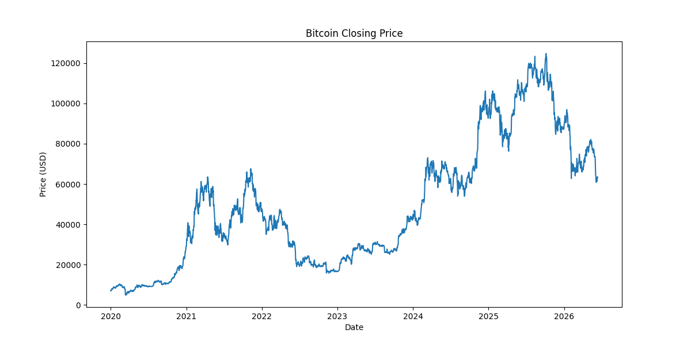
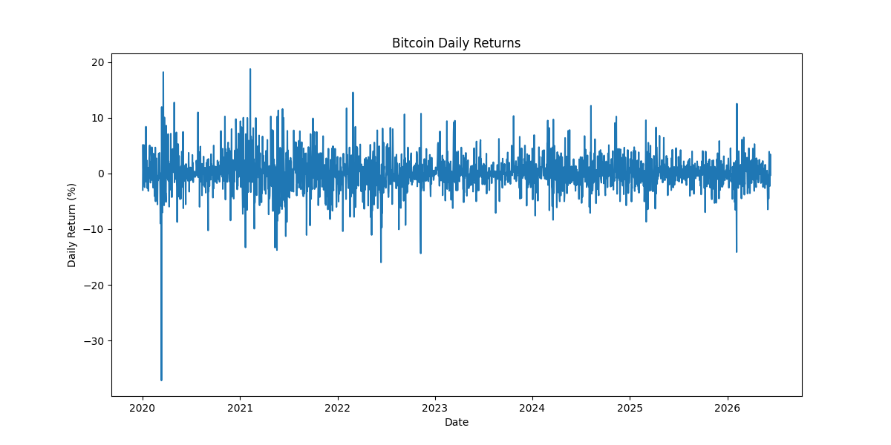
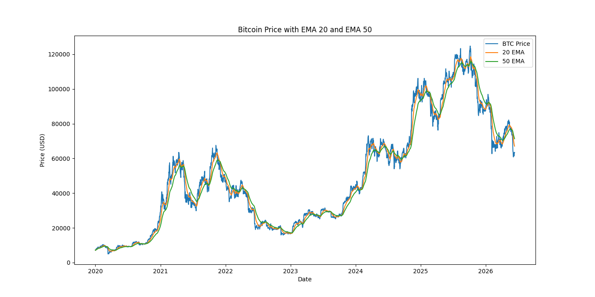
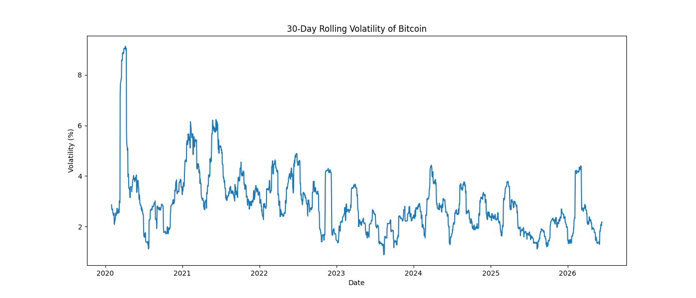
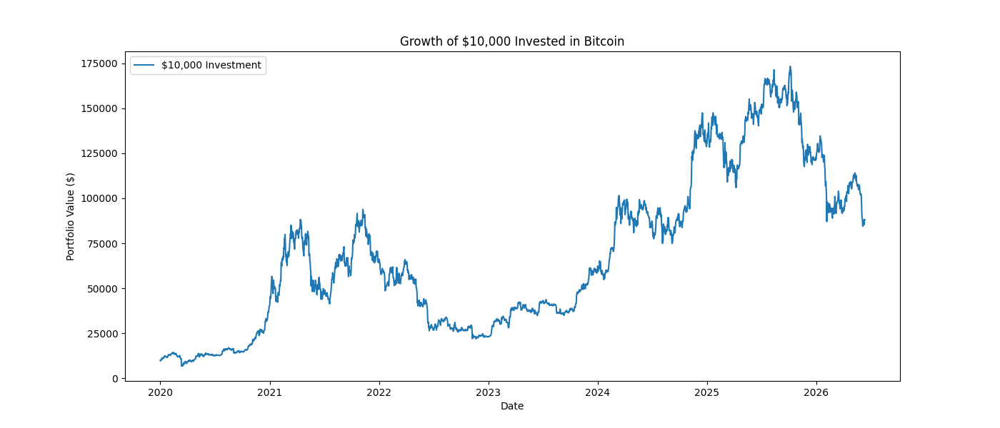
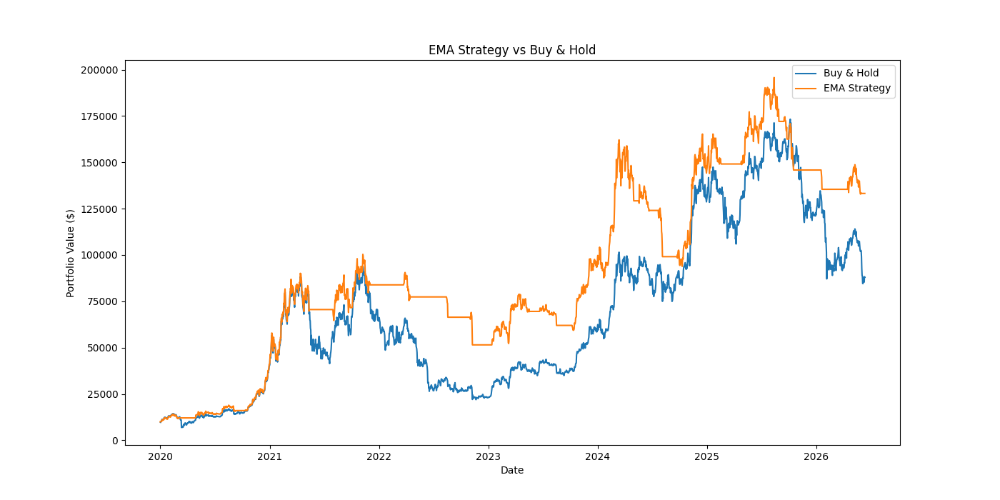

# Bitcoin Price Analysis

## Project Overview

This project analyzes Bitcoin historical price data from January 2020 onwards to identify market trends, evaluate investment performance, assess trading strategies, and measure risk-adjusted returns. Using Python and financial data analysis techniques, the project provides insights into Bitcoin's volatility, long-term growth potential, and the effectiveness of trend-following investment strategies.

---

## Objectives

- Analyze Bitcoin's historical price movements and trends.
- Measure daily returns and market volatility.
- Identify bullish and bearish phases using EMA indicators.
- Evaluate the growth of a hypothetical investment over time.
- Compare a Buy & Hold strategy with an EMA crossover strategy.
- Assess Bitcoin's risk-adjusted performance using the Sharpe Ratio.

---

## Tools and Technologies Used

- **Python**
- **Pandas**
- **Matplotlib**
- **NumPy**
- **Yahoo Finance API (yfinance)**
- **Jupyter Notebook**
- **GitHub**

---

## Dataset

Historical Bitcoin price data was obtained directly from Yahoo Finance using the `yfinance` Python library.

- **Asset:** Bitcoin (BTC-USD)
- **Period:** January 2020 – Present
- **Frequency:** Daily Data

The dataset includes:

- Open Price
- High Price
- Low Price
- Close Price
- Volume

---

## Analysis Performed

### 1. Historical Price Trend Analysis

Analyzed Bitcoin's closing prices over time to understand long-term market trends and major market cycles.

### Key Findings

- Bitcoin experienced significant bull runs during 2020–2021 and 2024–2025.
- Major corrections occurred during 2022 and subsequent market pullbacks.
- Long-term price appreciation highlights Bitcoin's potential as a high-growth asset.



---

### 2. Daily Returns Analysis

Calculated daily percentage returns to evaluate short-term price fluctuations and market behavior.

### Key Findings

- Bitcoin exhibits substantial day-to-day price volatility.
- Large positive and negative returns emphasize the speculative nature of cryptocurrency markets.



---

### 3. EMA Trend Analysis

Calculated:

- 20-Day Exponential Moving Average (EMA)
- 50-Day Exponential Moving Average (EMA)

to identify market trends and potential trend reversals.

### Key Findings

- Bullish phases were observed when EMA20 crossed above EMA50.
- Bearish phases occurred when EMA20 moved below EMA50.
- EMA indicators effectively captured major market trends.



---

### 4. Volatility Analysis

Computed 30-day rolling volatility using daily returns to assess Bitcoin's risk profile over time.

### Key Findings

- Bitcoin experienced periods of extreme volatility during major market events.
- Volatility spikes were associated with periods of uncertainty and rapid market movements.
- The cryptocurrency market remains significantly more volatile than traditional financial assets.



---

### 5. Best and Worst Trading Days Analysis

Identified the largest positive and negative daily returns during the analysis period.

### Results

#### Best Trading Day

- **Date:** 8 February 2021
- **Daily Return:** +18.75%
- **Closing Price:** $46,196

**Insight:**

This significant increase coincided with Tesla's announcement of its $1.5 billion Bitcoin investment, highlighting the impact of institutional adoption on cryptocurrency prices.

#### Worst Trading Day

- **Date:** 12 March 2020
- **Daily Return:** -37.17%
- **Closing Price:** $4,971

**Insight:**

This decline occurred during the global COVID-19 market panic, demonstrating Bitcoin's vulnerability during periods of extreme economic uncertainty.

---

### 6. Portfolio Growth Analysis

Evaluated the performance of a hypothetical investment of **$10,000** in Bitcoin beginning in January 2020.

### Results

- Initial Investment: **$10,000**
- Peak Portfolio Value: **Approximately $175,000**
- Final Portfolio Value: **Approximately $88,000**

### Key Insights

- The investment grew significantly over the analysis period despite experiencing substantial volatility.
- Bitcoin demonstrated exceptional long-term return potential.
- Investors must be prepared for significant drawdowns during market downturns.



---

### 7. Strategy Backtesting: EMA 20/50 Crossover Strategy

Implemented an EMA crossover strategy and compared its performance against a passive Buy & Hold approach.

### Strategy Rules

- **Buy Signal:** EMA20 > EMA50
- **Sell Signal:** EMA20 ≤ EMA50

### Results

| Metric | Value |
|---------|--------|
| Buy & Hold Portfolio Value | **$88,003** |
| EMA Strategy Portfolio Value | **$133,216** |
| Strategy Win Rate | **51.22%** |

### Key Insights

- The EMA strategy outperformed Buy & Hold by approximately **51%**.
- Despite a win rate of only 51.22%, effective trend capture contributed to superior performance.
- Trend-following approaches may help reduce downside exposure in volatile markets.



---

### 8. Risk-Adjusted Performance Analysis

Calculated the Sharpe Ratio to assess whether Bitcoin's returns adequately compensated investors for the level of risk undertaken.

### Results

- **Sharpe Ratio:** **0.72**

### Interpretation

A Sharpe Ratio of 0.72 suggests that Bitcoin generated substantial returns; however, these returns were accompanied by significant volatility.

### Key Insights

- Bitcoin offers considerable return potential but carries elevated investment risk.
- Risk management and portfolio diversification remain important considerations for investors.

---

## Overall Conclusions

This project demonstrates how data analytics techniques can be applied to financial markets to derive actionable insights related to:

- Market trends
- Investment performance
- Trading strategy effectiveness
- Risk management

The analysis indicates that while Bitcoin has historically delivered exceptional returns, disciplined investment strategies and appropriate risk management practices can improve overall investment outcomes.

---

## Skills Demonstrated

### Technical Skills

- Python Programming
- Data Cleaning and Transformation
- Exploratory Data Analysis (EDA)
- Time Series Analysis
- Financial Data Analysis
- Data Visualization
- Strategy Backtesting
- Risk Analysis
- GitHub Version Control

### Libraries Used

- Pandas
- Matplotlib
- NumPy
- yfinance

---

## Future Improvements

Potential enhancements to this project include:

- Maximum Drawdown Analysis
- Correlation Analysis with Traditional Assets
- Monthly Return Heatmaps
- Advanced Portfolio Metrics
- Machine Learning-Based Price Forecasting

---

## Repository Structure

```
Bitcoin-Price-Analysis/
│
├── Images/
│   ├── bitcoin_price_trend.png
│   ├── daily_returns.png
│   ├── ema_analysis.png
│   ├── volatility_analysis.png
│   ├── portfolio_growth.png
│   └── strategy_vs_buyhold.png
│
├── bitcoin_analysis.ipynb
├── README.md
├── LICENSE
└── .gitignore
```

---

## Author

**Ayush Verma**

Aspiring Data Analyst passionate about leveraging data analytics and financial insights to solve real-world problems.

GitHub: https://github.com/ayushverma-DA

LinkedIn: *(Add your LinkedIn profile link here)*

---

## Acknowledgements

- Yahoo Finance for providing historical market data.
- Python open-source community for analytical libraries and tools.
